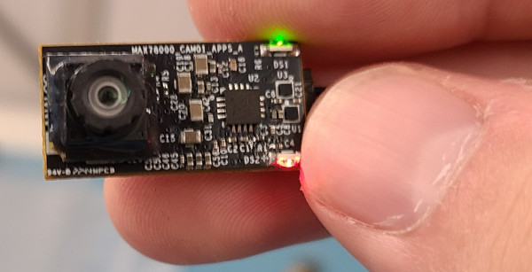

# Algorithm Optimization Example

## Overview
This project discusses techniques and concepts used in optimizing algorithms for
_speed_, specifically running in a resource constrained microcontroller 
environments.  The project targets a single application, and through successive 
iterations, highlights the performance improvements gained through modifications 
of the baseline design.  These improvements include topics such as minimizing 
memory accesses, fixed point/integer based calculations, incorporating assembly 
instructions, and utilizing SIMD operations.  

## Iteration Walkthrough
A walkthrough of all the iterations, as well as an overview of the algorithms 
can be found in the HTML pages located in the doc folder, [here](doc/index.html)

## Hardware Setup
This project utilizes the MAX78000 CAM01 Hardware running the FaceDetect demo.
More information on this hardware and demo can be found at the 
[cam01_facedetect_demo Github Page](https://github.com/Analog-Devices-MSDK/msdk/tree/main/Examples/MAX78000/CNN/cam01_facedetect_demo)

## Software Setup
In order to show the iterative improvements through minor changes, several 
versions of the debayering.c, debayering.h and main.c files are provided.
These variations are located in the Iterations folder.  In order to build the
code described in each iteration of the documents, the files need to be copied
to the root folder as debayering.c, debayering.h and main.c per the table below.  The
final iteration (iteration 9) is provided in root to start.
| Iteration | debayering.c | debayering.h | main.c |
| --------- | ------------ | ------------ | ------ |
| Baseline  | debayering_baseline.c | debayering_baseline.h | main_baseline.c |
| AWB: 1  | debayering_iteration1.c | debayering_baseline.h | main_baseline.c |
| AWB: 2  | debayering_iteration2.c | debayering_baseline.h | main_baseline.c |
| AWB: 3  | debayering_iteration3.c | debayering_baseline.h | main_baseline.c |
| AWB: 4  | debayering_iteration4.c | debayering_baseline.h | main_baseline.c |
| Bayer: 5  | debayering_iteration5.c | debayering_iteration5.h | main_iteration5.c |
| Bayer: 6  | debayering_iteration6.c | debayering_iteration6.h | main_iteration6.c |
| Bayer: 7  | debayering_iteration7.c | debayering_iteration6.h | main_iteration6.c |
| Bayer: 8  | debayering_iteration8.c | debayering_iteration8.h | main_iteration8.c |
| Bayer: 9  | debayering_iteration9.c | debayering_iteration8.h | main_iteration9.c |

## Building and Flashing the Project
The firmware project requires the Analog Devices MSDK for targeting the 
MAX78000.  Refer to the [Analog Devices MSDK User Guide](https://analog-devices-msdk.github.io/msdk/USERGUIDE/)
for download and installation instruction. 

### *Building and Flashing with VS Code*
The following instructions are for building and flashing the demo via
Visual Studio Code
 1. Open the VS Code IDE
 2. Select File->Open Folder
 3. Navigate to the cam01_facedetect_demo_opt folder, and select Open
 4. Select Terminal->Run Build Task
 5. In the Build Task list, select Build.
     * The VS Code terminal window will show the build progress
 6. Connect the MAX78000 CAM01 board a suitable debugger (such as the 
    MAX32625PICO), and connect the debugger to the PC using a USB Micro-B cable
 7. From VS Code, select Terminal->Run Build Task
 8. In the Build Task list, select Flash
     * The VS Code terminal window will show the flashing progress

### *Building and Flashing from the Command line*
The following instructions are for building and flashing the demo via
the command line
 1. Open the MinGW command prompt provided with the MSDK installation
 2. Navigate to the cam01_facedetect_demo_opt folder
 3. At the prompt run the command `make TARGET=MAX78000`
 4. Connect the MAX78000 CAM01 board a suitable debugger (such as the 
    MAX32625PICO), and connect the debugger to the PC using a USB Micro-B cable
 5. At the prompt run the command    
 `openocd -s $MAXIM_PATH/Tools/OpenOCD/scripts -f interface/cmsis-dap.cfg -f target/max78000.cfg -c "program build/max78000.elf verify exit"`

