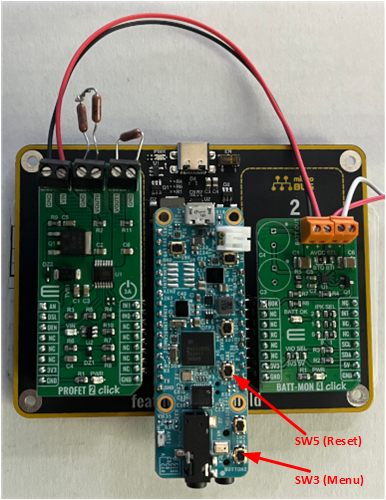
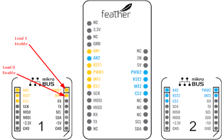
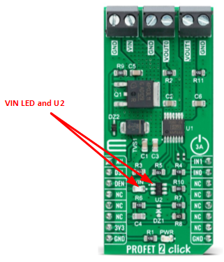
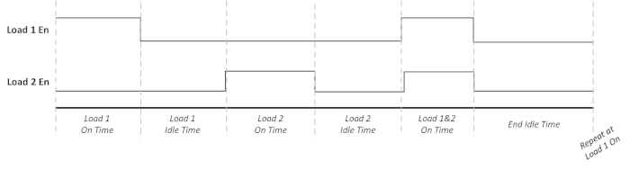
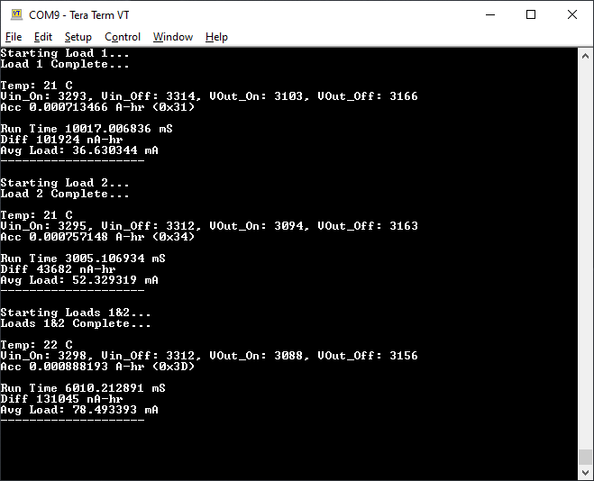
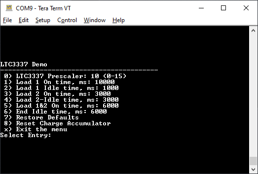

# LTC3337 Demo

## Overview
This demo setup provides a configurable test setup for evaluating the 
[Analog Devices LTC3337](https://www.analog.com/en/products/ltc3337.html) 
under different load and configuration conditions.  
The setup has a dedicated path from power supply (battery) through the LTC3337 
to two independently configurable loads for accurate evaluation of the LTC3337.  
Required equipment:
 * [MIKROE BATT-4-MON Click](https://www.mikroe.com/batt-mon-4-click) (LTC3337)
 * [MAX32655FTHR](https://www.analog.com/en/design-center/evaluation-hardware-and-software/evaluation-boards-kits/max32655fthr.html)
 * [MIKROE PROFET 2-3A](https://www.mikroe.com/profet-2-click-3a)
 * [MIKROE Feather Click Shield](https://www.mikroe.com/feather-click-shield)

Additional Software:
 * Terminal Emulator (TeraTerm, RealTerm, Putty, etc)

## Hardware Setup
For correct GPIO mapping the BATT-4-MON click board must be placed in location 
"2" on the click shield, and the PROFET-2 click board must be placed in location
"1".

Connect BATT OUT of the BATT-4-MON to VIN of the PROFET-2.  Connect the desired 
loads to VOUT0 and VOUT1 of the PROFET-2 respectively. In this example, VOUT0 is
a 66 and 33 Ohm 1/2W resistor in series, and VOUT1 is a 66 Ohm 1/2W resistor.

Connect the desired power source to BATT IN of the BATT-4-MON board.

### *Alternate Load Control*
The PROFET-2 is controlled Active High by GPIOs from the MAX32655FTHR board. 
In place of the PROFET-2, to control different device(s), utilize the GPIO 
signals which are routed to Click "1" INT and PWM respectively.

### *Board Modifications (Optional)*
The PROFET-2 features LED (LD2/VIN) which is driven by VIN.  To accurately 
measure only the load(s) with the LTC3337, LD2 must be disabled. 
This can be done by removing LD2, or lifting pin 1 of U2.

## Building and Flashing the Project
The firmware project requires the Analog Devices MSDK for targeting the 
MAX32655.  Refer to the [Analog Devices MSDK User Guide](https://analog-devices-msdk.github.io/msdk/USERGUIDE/)
for download and installation instruction. 

### *Building and Flashing with VS Code*
The following instructions are for building and flashing the LTC3337 demo via
Visual Studio Code
 1. Open the VS Code IDE
 2. Select File->Open Folder
 3. Navigate to the ltc3337_demo folder, and select Open
 4. Select Terminal->Run Build Task
 5. In the Build Task list, select Build.
     * The VS Code terminal window will show the build progress
 6. Connect the MAX32655FTHR board to the PC using a USB Micro-B cable
 7. From VS Code, select Terminal->Run Build Task
 8. In the Build Task list, select Flash
     * The VS Code terminal window will show the flashing progress

### *Building and Flashing from the Command line*
The following instructions are for building and flashing the LTC3337 demo via
the command line
 1. Open the MinGW command prompt provided with the MSDK installation
 2. Navigate to the ltc3337_demo folder
 3. At the prompt run the command `make TARGET=MAX32655`
 4. Connect the MAX32655FTHR board to the PC using a USB Micro-B cable
 5. At the prompt run the command    
 `openocd -s $MAXIM_PATH/Tools/OpenOCD/scripts -f interface/cmsis-dap.cfg -f target/max32655.cfg -c "program build/max32655.elf verify exit"`

## Running the Demo
To run the demo, connect and apply power to the BATT IN terminals of the 
BATT-4-MON, then connect the MAX32655 FTHR to the PC using the USB Micro B
connector.  

> **Note:** Since the FTHR board is powered via USB and not BATT IN, for
correct initialization, BATT IN power must be applied first.  If initialization
was not executed correctly, the FTHR board may be reset be pressing SW5

Open the terminal emulator application on the PC, and connect to the FTHR 
USB serial port.  The connection settings are 115,200bps, 8 Data Bits, No Parity, 
1 Stop bit. The demo will automatically run at power on, printing statistics 
during each configured load sequence.  The configuration settings are stored 
persistenly in flash through power cycles.

### *Load Sequence and Statistics*
The demo provides configurable timing for each sequence as shown in the diagram
below. This sequence repeats indefinitely while the demo is running. 
Optionally, any on or idle stage may be disabled by configuring the time
value to 0.

The LTC3337 is sampled at the start and end of each "On" cycle.  Once the "on"
cycle is completed, the current state of the LTC3337 is provided to the terminal,
including BATT In and Out voltages (in mV) for IPeak On and Off, current die 
temperature, and current accumulated charge register value.  The provided LTC3337 
driver provides code to convert the charge register to A-Hr based on the chip's 
prescale and IPeak values.

In addition, the charge accumulated during the on cycle is provided, along with
on time provided by a high resolution timer, and finally a calculated average 
load during the duration of the on cycle.

### *Configuring the Sequence*
To enter the configuration menu, press SW3 on the FTHR board. The current 
operation will be stopped, all loads disabled, and the configuration menu 
displayed in the terminal.

To change a configuration value, first enter the menu number, followed by the
Enter key.  At the `Enter new value:` prompt, enter the new value, followed by
the Enter key. The menu will be redrawn with the updated values.  To exit the 
menu, enter the 'x' option.  Once the menu exits, the configuration will be
saved to flash, and the sequence loop will restart with the new values starting
at Load 1 On.  **The configuration will not be written to flash unless the menu
is exited through 'x' option.**

> **Note:** By default, the console interface is compiled to respond to LF line
endings. Ensure your terminal emulator is configured for LF, or optionally
recompile the project by passing a different line ending option to the console
initialization.

## Porting the Demo to Different Platforms
The demo software attempts to remain *relatively* platform independent. To port
the firmware to a different hardware platform, modify the contents of the 
platform.c file to meet the API of the platform's hardware abstraction layer. 
Platform.c provides wrappers for I2C communications, delays, high resolution
timers, console UARTs, and GPIOs for load, button and interrupt handling.

The exception to platform.c is the loading and saving of the configuration data
from flash.  Due to the varying types of non-volatile memory on devices, as well
as their support for CRCs and error correcting, loading and storing of config 
data is done through the LoadConfiguration and SaveConfiguration functions 
found main.c

## Utilizing the LTC3337 Driver in Custom Applications
The LTC3337 driver is written to be platform independent, abstracting the I2C 
communciations and utilizing only 32-bit integer math in order to support 
platforms without floating-point co-processors.  There are 2 options for 
utilizing the LTC3337 driver outside this demo:
 1. Implement the Platform_i2c* functions called by the LTC3337 Driver
 2. Modify LTC3337_ReadReg and LTC3337_WriteReg functions in LTC3337.c to call
 the platform's native I2C interface API

Both cases provide simple paths forward for utilizing the LTC3337 driver with
minimal modifications required.